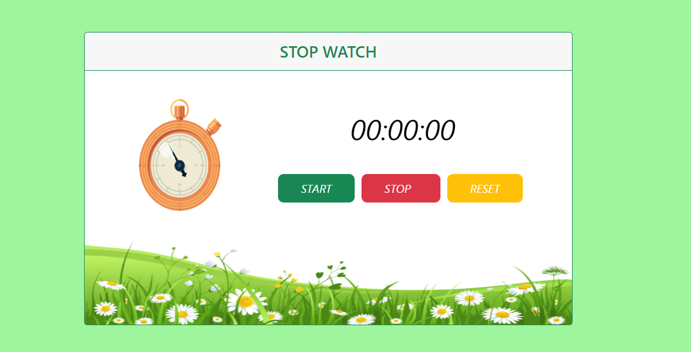
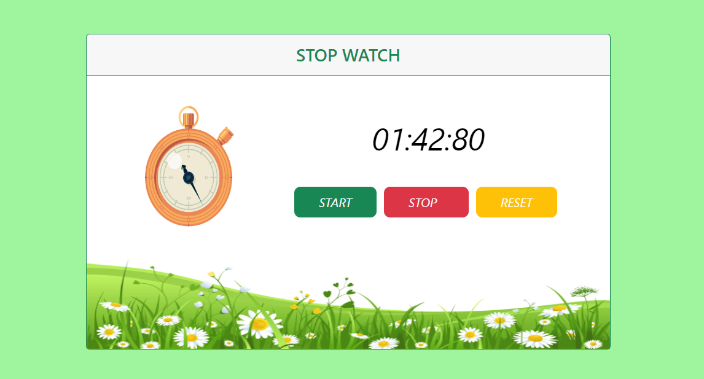

<h1> Digital Stop Watch App </h1>

 
    It is simple responsive web application using vanilla JavaScript code.  
    Here, Start the stop watch using start button, Stop button for stop the stop watch time and reset button for reset at zero time.  

<h3> Technology used: </h3>

<ul>
    <li>HTML</li>
    <li>CSS</li>
    <li>JavaScript</li>

</ul>

<h3> ScreenShots: </h3>

    
    

